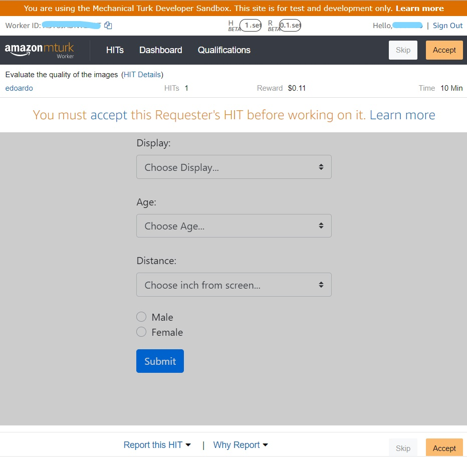

# MTurkImageQuality

## Esecuzione
Eseguire il modulo app.py per visualizzare la pagina web, è necessario un database (ad esempio con phpmyadmin su [XAMPP](https://www.apachefriends.org/it/download.html)) (in: "localhost", nome utente:"testuser", psw accesso:"test123", nome db:"mysqldb").
Successivamente eseguire il modulo Main.py per creare l'HIT con il sito mostrato in precedenza in app.py.
## Librerie utilizzate
```python
os
random
pickle 
pymysql
flask
boto3
ssl
```



(Grafica azzurra in fase di miglioramento)


## License
[Edoardo Re](https://github.com/edoardore), 2019
